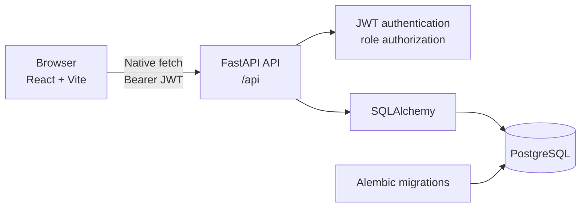
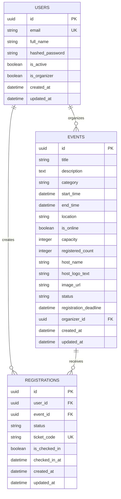

# Meetora

Meetora is a full-stack event discovery and registration platform for campus communities. Attendees can discover and register for published events, while organizers can create, publish, manage, and check in attendees from a protected workspace.

## Why Meetora

- **One workflow:** discover events, view details, register, receive a ticket code, and manage registrations.
- **Two roles:** attendee experiences stay simple; organizer tools are protected by role-based access control.
- **Real data:** events, users, registrations, waitlists, and check-ins are persisted in PostgreSQL through a FastAPI API.

## Features

### Attendees

- Create an account and sign in with JWT authentication
- Browse published organizer events
- Search by title or description and filter by category, date, and availability
- View event details, capacity, location, and schedule
- Register for available events or join a waitlist when capacity is reached
- Cancel registrations
- View registrations, ticket codes, and check-in status

### Organizers

- Organizer-only dashboard and event workspace
- Create and edit events
- Save drafts and publish events
- Update event status
- View attendee and registration information
- Search attendee records and manage check-in
- Role-protected organizer routes

## Tech Stack

| Layer | Technologies |
|---|---|
| Frontend | React 19, TypeScript, Vite, Tailwind CSS v4, React Router |
| Forms and validation | React Hook Form, Zod |
| Backend | Python 3.12, FastAPI, Uvicorn |
| Data | SQLAlchemy, PostgreSQL 16, Alembic |
| Authentication | JWT, Passlib Argon2 |
| Infrastructure | Docker Compose |


## Project Structure

```text
MeetoraKG/
├── backend/
│   ├── app/
│   │   ├── api/v1/endpoints/   # Auth, events, registrations, check-in
│   │   ├── models/             # User, Event, Registration
│   │   ├── schemas/            # Pydantic request/response models
│   │   └── core/               # Settings, database, security
│   ├── app/alembic/            # Database migrations
│   └── tests/                  # Backend tests
├── frontend/
│   └── src/
│       ├── pages/              # Attendee and organizer screens
│       ├── components/         # Shared layout and UI components
│       ├── context/            # Auth and theme state
│       └── lib/api.ts          # Native fetch API client
├── docker-compose.yml
└── .env.example
```

## System Architecture



The frontend uses `VITE_API_BASE_URL` to reach the backend. The backend validates JWTs, enforces attendee/organizer permissions, applies public event filtering, and persists all changes in PostgreSQL.

## Database Architecture

The implemented schema contains three core tables:

- **users** — account details, password hash, active state, and `is_organizer`.
- **events** — event content, schedule, capacity, status, image URL, and optional `organizer_id` referencing `users`.
- **registrations** — user/event relationship, registration status (`confirmed`, `waitlist`, or `cancelled`), unique ticket code, and check-in fields.

Important constraints:

- User emails are unique.
- A user can have only one registration record per event.
- Event deletion cascades to registrations.
- Removing an organizer does not delete the event (`organizer_id` is set to `NULL`).
- Public event discovery includes published/available organizer-owned events, not drafts.



## Quick Start

### Prerequisites

- Node.js and npm
- Python 3.12
- PostgreSQL 16, Docker Desktop
- `uv` for backend dependency management

### 1. Configure the environment

From the repository root:

```powershell
Copy-Item .env.example .env
```

For a local frontend/backend setup, copy the frontend template too:

```powershell
Copy-Item frontend\.env.example frontend\.env
```

The default local API URL is `http://localhost:8000`.

### 2. Start the Docker deployment

```powershell
docker compose up -d --build
```

Compose starts PostgreSQL, runs Alembic migrations automatically in the API container, and serves the production frontend through Nginx. The frontend image receives `VITE_API_BASE_URL` at build time; this must be a URL reachable by the browser, not the internal `db` or `api` service hostname.

Open **http://localhost:5173**.

The root `.env` may define `POSTGRES_USER`, `POSTGRES_PASSWORD`, `POSTGRES_DB`, `POSTGRES_PORT`, `API_PORT`, `FRONTEND_PORT`, `ENVIRONMENT`, `CORS_ORIGINS`, and `VITE_API_BASE_URL`. The defaults in [`.env.example`](./.env.example) are suitable for local Docker use. Change `VITE_API_BASE_URL` and `CORS_ORIGINS` together when deploying behind a different public API URL or frontend origin.

To stop the stack without deleting the PostgreSQL data volume:

```powershell
docker compose down
```

To rebuild after changing frontend source or the API URL:

```powershell
docker compose build --no-cache frontend
docker compose up -d
```

For local development without the frontend container, keep using `frontend\.env` with `VITE_API_BASE_URL=http://localhost:8000` and run `npm run dev`.

## Application URLs

| Purpose | URL |
|---|---|
| Frontend | http://localhost:5173 |
| API health | http://localhost:8000/api/health |
| Swagger docs | http://localhost:8000/api/docs |
| ReDoc | http://localhost:8000/api/redoc |
| Attendee events | http://localhost:5173/events |
| Organizer workspace | http://localhost:5173/organizer |

## Demo Organizer Account

The development seed script provides:

```text
Email:    organizer@meetora.com
Password: Organizer123!
```

## Application Workflow

```text
Register / Sign in
        │
        ├── Attendee → Explore → Event details → Register / Waitlist → My Registrations
        │
        └── Organizer → Dashboard → Create draft → Publish → Manage attendees → Check in
```

## API Overview

| Area | Main routes |
|---|---|
| Auth | `POST /api/auth/register`, `POST /api/auth/login`, `GET /api/auth/me` |
| Public events | `GET /api/events`, `GET /api/events/{event_id}` |
| Organizer events | `GET /api/events/organizer/my-events`, `POST /api/events`, `PUT /api/events/{event_id}` |
| Registration | `GET /api/events/{event_id}/registration`, `POST /api/events/{event_id}/register`, `DELETE /api/events/{event_id}/register` |
| Attendee list | `GET /api/registrations/me` |
| Organizer operations | `GET /api/events/{event_id}/attendees`, `POST /api/events/{event_id}/status`, `GET /api/events/{event_id}/check-in/lookup`, `POST /api/events/{event_id}/check-in` |

All protected routes require the JWT returned by `/api/auth/login` in the `Authorization` header using the `Bearer` scheme.

## Migrations and Tests

Run migrations:

```powershell
cd backend
uv run alembic upgrade head
```

Run backend tests:

```powershell
uv run pytest
```

Run frontend checks:

```powershell
cd frontend
npm run lint
npm run build
```

## Troubleshooting

- **API connection errors:** confirm the backend is running on port `8000` and that `frontend/.env` points to the same URL.
- **Database errors:** check `docker compose ps`, then inspect `docker compose logs db api`.
- **CORS errors:** ensure the frontend origin is included in `CORS_ORIGINS`.
- **Missing public events:** only published events owned by organizer accounts are shown publicly; drafts remain in the organizer workspace.

## Author

Meetora — Gajjar Krehant
